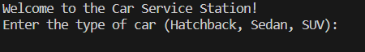
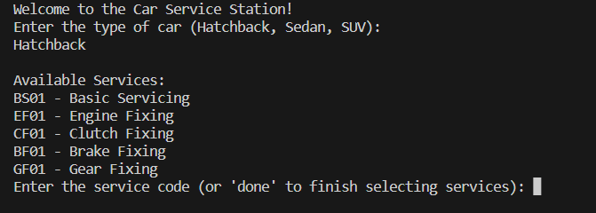
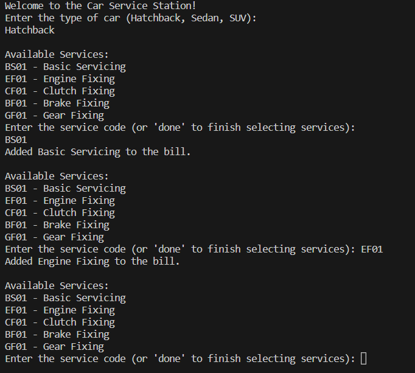
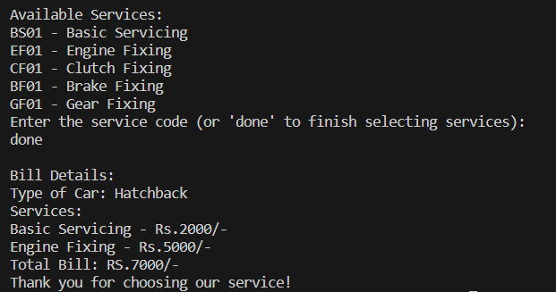
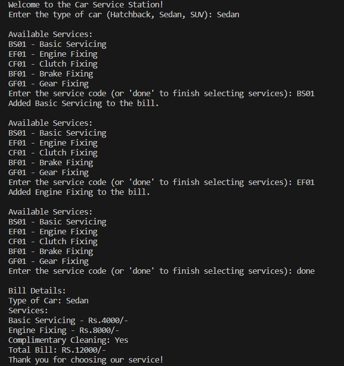

<h1 align="center"> Car Service Bill Generator Application(OOPs)👋</h1>
This Java application simulates a car service station that offers different types of services for various car types. The application allows users to generate a detailed bill based on the selected car type and service codes.

## Class Car
The Car class represents a car of which type :

1.Hatchback

2.Sedan

3.SUV

## Class Service 
The Class Service represents the following attributes :

1.serviceCode

2.serviceName

3.hatchbackPrice

4.sedanPrice

5.suvPrice

## Class ServiceStation
The Class ServiceStation has the following services :

1.EngineFixing:

2.ClutchFixing:

3.BrakeFixing:

4.GearFixing:

## Clas CarServiceApplication

1.Enter the Car Type :

    Hatchback,Sedan,suv.

2.Enter the Service Code(or 'done' to finish selecting services) :

    Gives the List of available services by providing code.

3.Bill Details :

    The application will generate a detailed bill, displaying the car type, service codes, charges for each service, total bill amount, and a complimentary cleaning message if the total bill exceeds ₹10,000.

## Getting Started
To run the Car Service Bill Generator, follow these steps:

1.Ensure you have Java installed on your system.

2.Download the source code files or clone the repository.

3.Compile the Java source files using the following command:
``` bash 
javac CarServiceApplication.java
```
4.Run the application with the following command:

```bash 
java CarServiceApplication
```
5.Follow the on-screen instructions to interact with the Car Service Bill Generator.

## Usage

Once the application is running, you will be presented with a menu of actions to choose from. Enter the corresponding number for the action you want to perform:











## Video Explanation
https://drive.google.com/file/d/1EB9qigr-XeQrHyhUBayW65RfLSl-vnau/view?usp=sharing

## OOPS Concepts Used
In the Car Service Bill Generator code provided, several Object-Oriented Programming (OOP) concepts have been utilized. Here are the OOP concepts used in the implementation:

1.Classes and Objects:

- The **```Car```** class represents different types of cars. It encapsulates the carType attribute and provides a getter method to retrieve the car type.
- The **```Service```** class represents the different services offered at the service station. It encapsulates attributes like serviceCode, serviceName, hatchbackPrice, sedanPrice, and suvPrice. It also provides methods to access these attributes.
- The **```ServiceStation```** class is responsible for managing the available services. It maintains a list of Service objects and provides a method to find a service by its code.

2.Encapsulation:

- All classes encapsulate their internal attributes, providing controlled access through getter methods. This helps in maintaining data integrity and controlling access to internal data.

## Contributing
Contributions to the Car Service Bill Generator project are welcome! If you find any bugs or have suggestions for improvement, please open an issue or submit a pull request.

## License📝
This project is generated by [@Swati Mahajan](https://github.com/mahajanswatgithub)

## Acknowledgement
The Car Service Bill Generator was developed as an example implementation based on OOPs concepts.

## Disclaimer✍️
This Car Service Bill Generator is a simplified program for educational purpose and does not represent a real coffee machine or its functionalities.
